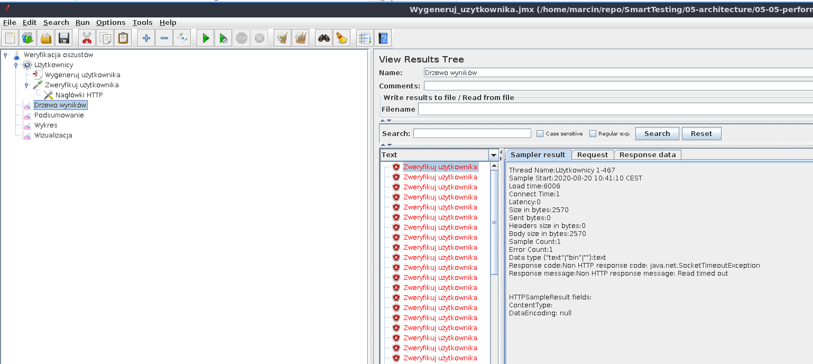

# 05-05 Testy wydajności

## Uruchomienie testów wydajnościowych za pomocą Apache JMeter

Najpierw uruchamiamy infrastrukturę.

```
docker-compose up
composer install
bin/console d:m:m
```

Stawiamy aplikację wykorzystując dev server:

```
symfony server:start --no-tls
```

Instalujemy i uruchamiamy aplikację Apache JMeter - https://jmeter.apache.org/

Importujemy plik z konfiguracją wygenerowania użytkownika `tests/jmeter/Wygeneruj_uzytkownika.jmx` poprzez kliknięcie w `File->Open`. Testy wydajnościowe ustawione są pod uruchomienie na porcie `8000`.


To co chcemy osiągnąć to wysłanie JSONa w celu wygenerowania użytkownika.


Chcemy przeprowadzić load testy, czyli zobaczyć ilu użytkowników jesteśmy w stanie obsłużyć. Oczywiście na potrzeby szkolenia nie przygotowujemy specjalnego środowiska, uruchamiamy po prostu aplikację lokalnie.


`Ramp-up period` : Czas, który JMeter potrzebuje, żeby uruchomić odpowiednią liczbę wątków. W naszej sytuacji JMeter ma 10 sekund, żeby uruchomić 10 000 wątków. Czyli co sekundę uruchomionych zostanie kolejnych 1 000 wątków.

Ustawiamy konfigurację związaną z połączeniem (max 1 000 ms, na połączenie i 6 000 ms na odpowiedź).


Uruchamiamy testy poprzez wciśnięcie zielonego przycisku play na górze.


W pewnym momencie możemy zauważyć, że wyskakują nam błędy (chyba że twój sprzęt udzwignie, co może się zdarzyć).


Błędy dotyczą połączenia.



Możemy też pokazać podsumowanie związane z uruchomieniem naszego testu.


## Uruchomienie testów micro-benchmarkingu za pomocą PHPBench 

[phpbench/phpbench](https://github.com/phpbench/phpbench)

W klasie `CustomerVerifierBench` mamy zdefiniowane testy micro-benchmark. Więcej o poszczególnych adnotacja można poczytać w dokumentacji.

Żeby je uruchomić odpalamy `vendor/bin/phpbench run tests/Benchmark/CustomerVerifierBench.php --report=default`.

I dostaniemy mniej więcej taki wynik w konsoli.

```
PhpBench @git_tag@. Running benchmarks.
Using configuration file: /var/www/smarttesting-php/05-architecture/05-05-performance/phpbench.json

\SmartTesting\Tests\Benchmark\CustomerVerifierBench

    benchVerify.............................I2 [μ Mo]/r: 20.910 20.535 (ops/ms) [μSD μRSD]/r: 0.002ms 3.28%

1 subjects, 3 iterations, 100 revs, 0 rejects, 0 failures, 0 warnings
(best [mean mode] worst) = 45.630 [47.823 48.697] 49.200 (μs)
⅀T: 143.470μs μSD/r 1.568μs μRSD/r: 3.278%
suite: 1343e9edd01a434e00e9c34a38791d8766c70f93, date: 2020-11-18, stime: 00:00:52
+-----------------------+-------------+-----+------+------+------------+--------------+--------------+----------------+
| benchmark             | subject     | set | revs | iter | mem_peak   | time_rev     | comp_z_value | comp_deviation |
+-----------------------+-------------+-----+------+------+------------+--------------+--------------+----------------+
| CustomerVerifierBench | benchVerify | 0   | 100  | 0    | 2,100,624b | 20.559ops/ms | +0.52σ       | +1.71%         |
| CustomerVerifierBench | benchVerify | 0   | 100  | 1    | 2,100,624b | 20.325ops/ms | +0.88σ       | +2.88%         |
| CustomerVerifierBench | benchVerify | 0   | 100  | 2    | 2,100,624b | 21.915ops/ms | -1.4σ        | -4.59%         |
+-----------------------+-------------+-----+------+------+------------+--------------+--------------+----------------+
```

## Bonus

Istnieje jeszcze jedno narzędzie dedykowane dla PHP: [blackfire.io](https://blackfire.io/)
Blackfire umożliwia zarówno debugowanie kodu pod kątem szybkości jak i za równo możliwość pisania testów wydajnościowych (przykładowo dana ścieżka w aplikacji ma trwać poniżej 500ms).
