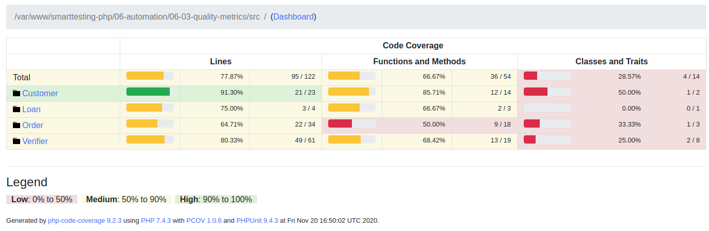
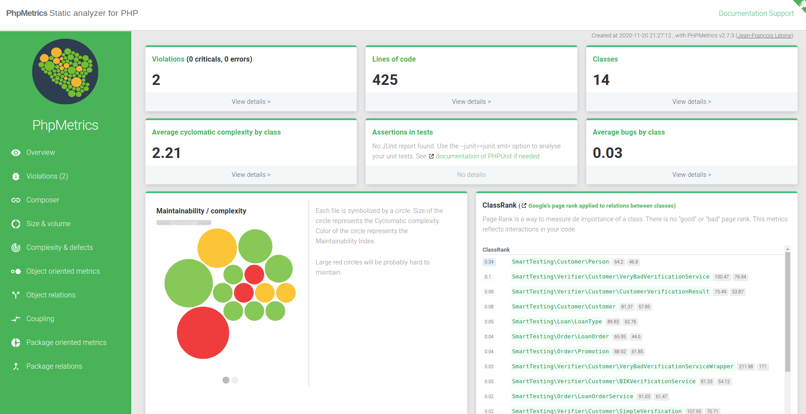
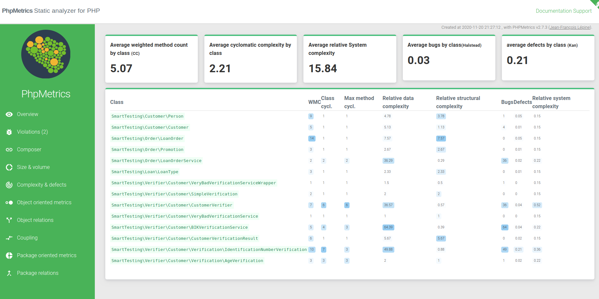

# 06-03 Metryki jakość

## Wymagania

Do wygenerowanie raportu code coverage potrzebny jest tzw. driver (na przykład xdebug lub pcov).
Obecnie zalecam użycie `pcov` gdyż jest dużo szybszy od xdebug (choć wersja 3.0 xdebuga może dużo zmienić ;)).

Instalacja `pcov`:

```
pecl install pcov
```

Trzeba będzie dodać `extension=pcov.so` do `php.ini` (dla ubuntu jest w ścieżce: `/etc/php/7.4/cli/php.ini`).
Inne sposoby instalacji: https://github.com/krakjoe/pcov/blob/develop/INSTALL.md

## Raport code coverage

```
composer code-coverage
```

Raport zostanie wygenerowany w katlogu `coverage`. Otwieramy plik `coverage/index.html` aby obejrzeć raport.
W celu podglądu analizy klas pod kątem złożoności cyklomatycznej otwieramy `coverage/dashboard.html`. Znajduje się tam sekcja "
Complexity" w której zobaczymy wykres (z najbadziej złożonymi klasami w górnej części).



## Inne narzędzia

Zamiast instalować kolejne zależnosci polecam zaznajmowić się z [jakzal/phpqa](https://github.com/jakzal/phpqa). Jest to zbiór narzędzi typu quality assuarance zawarty w jednym obrazie dockerowym. Przykładowo możemy wygenerować sobie raport złożoności przy pomocy https://github.com/phpmetrics/PhpMetrics używając prostego polecnia:

```
docker run --init -it --rm -v "$(pwd):/project" -w /project jakzal/phpqa phpmetrics --report-html=myreport src
```

Przykładowy dashboard oraz zakłada z metrykami:





Narzędzi jest dużo więcej, zachęcam do samodzielnego eksperymentowania. W razie pytań lub problemów zachęcam do używania naszego slack lub twittera (@ArkadiuszKondas).
